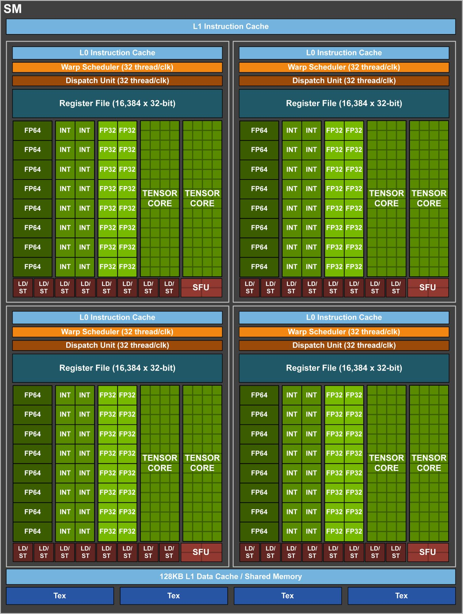
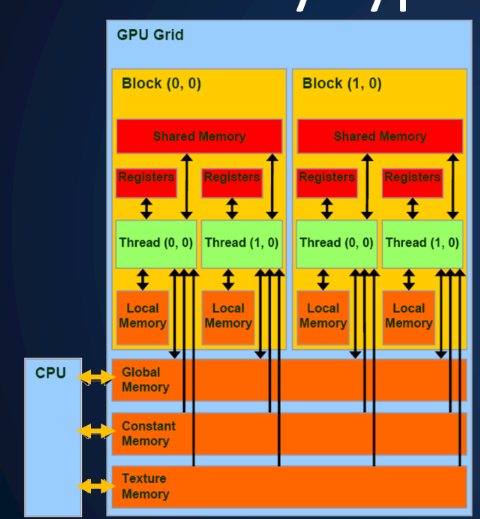
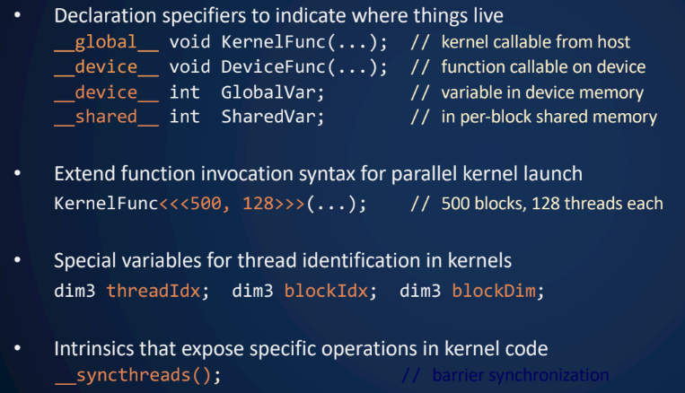
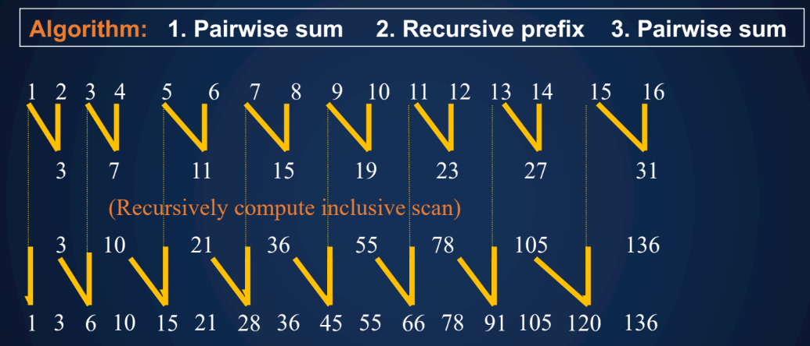
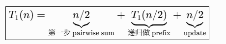
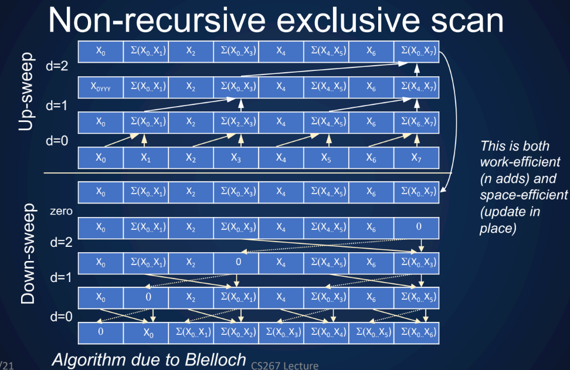
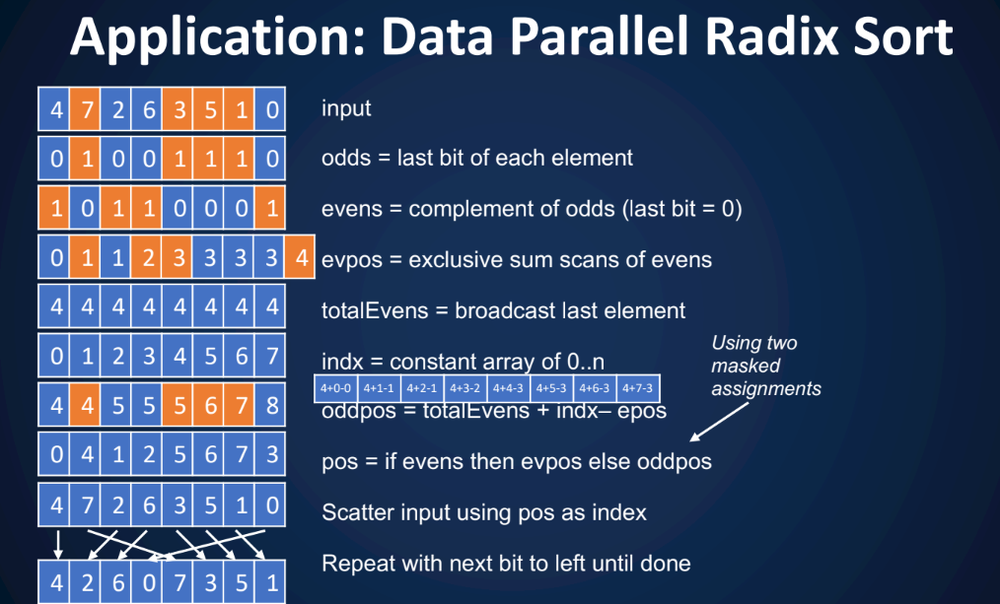
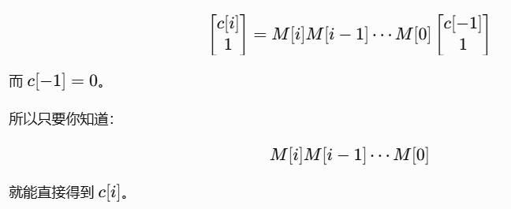

# Class 1:Intro
## 1.parallel computer


1. shared memory multiprocessor(SMP*, “Symmetric Multi-Processor”) multiple processors, single memory system
- A multicore processor: chip containing multiple processors (cores)

2. distributed memory multiprocessor(HPC)processors with their own memories connected by a high speed network
- cluster
- usually 100/1000s of them
  
3. SIMD: multiple processors (or functional units) that perform the
same operation

## 2.Measures for HPC
1. units: 
- Flop: double(64-bit) operation
- Flop/s: per second
- Bytes
  - Goal: Exa Eflops computer, Eflops


GiB 念作 Gibibyte

2. Top supercomputer: use Linpack benchmark to measure
- Top 1 in 2021: Fugaku Japan

3. use application to measure

## 3.where to use HPC
1. Simulation in Science and engineering
2. Data Analysis
3. Machine learning(much more data being used by far every year)
4. Theory
5. Experiment

## 4.How to cover all applications
1. 7 dwarfs of simulation: 
- Dense Linear Algebra
- Sparse Linear Algebra
- Particle Methods
- Structured Grids
- Unstructured Grids
- Spectral Methods (e.g. FFT)
- Monte Carlo

## 5.Trend: Dennard Scaling is Dead; Moore’s Law Will Follow
1. Dennard Scaling: As transistors get smaller, their power density stays constant.
- dead: Transistors got so tiny that leak the current漏电
2. Moore's Law: The number of transistors on a chip doubles approximately every two years.
3. Amdahl's Law: performance is limited by the sequential part even if the parallel part speeds up perfectly
Speedup(P) = Time(1)/Time(P)
<= 1/(s + (1-s)/P)
<= 1/s  
【注释】摩尔定律 （Moore‘s Law）：回答的是 “我们能放多少晶体管？” 的问题。它至今仍在以某种形式延续（尽管也面临挑战）。  
【注释】Dennard Scaling：回答的是 “这些晶体管耗电和发热厉害吗？功耗相同吗？” 的问题。它大约在2004年已经基本失效。  
【注释】摩尔定律允许你在同样大的土地上盖越来越多的房子（晶体管）。Dennard Scaling 曾保证这些新房子都使用节能电器，所以整个城市的用电总量不会爆表。
但当Dennard Scaling失效后，新房子（纳米级晶体管）的电器漏电严重（漏电流），即使不用也耗电。城市（芯片）的总用电和发热量急剧增加，导致你不能再无限制地增加人口（提升频率）了，否则电网会瘫痪（过热烧毁）。于是，你只好在城市旁边再建几个新的小城镇（多核），让居民分散居住和工作（并行计算）。
【recall】 speedup?   Time original/Time new

# Class 2 MemHierarchy & MM
## 1.processors & regs
1. compilers manage the regs
- graph colouring  
【拓展】compiler还做什么：unroll/fuse/reorder loops, eliminate dead code, they sometimes do optimizations well, but sometimes don't!

## 2.mem hirerarchy (recap)

### (1)basic ideas
(a)latency & bandwidth
- latency α: how long one memory access takes.
- bandwidth β: how much data memory can transfer per unit time.  
(b)spacial locality & temporal locality  

## (2)cache
- managed by HW
- Associativity = number of ways = number of cache lines/blocks in each set 

## (3)concurrency
(a)handle mem latency concurrently：
- Vector访存操作: move/request lots of data → exploit bandwidth
- 多个独立操作: overlap waiting times → hide latency  

(b)需要多少concurrency：Little's Law：concurrency = latency * bandwidth

### *microbenchmark for mem system performance 

## 3.parallelism within sigle processors
data dependency会阻碍parallelism: RAW WAR WAW

### (1) ILP & pipelining
(a) ILP：没依赖的指令同时进行，比如add、mul  
(b) pipelining：F-D-Ex-Mem-WB，多个操作同时在流水线上用不同的unit
- 提升throughput

### (2) SIMD units
SIMD instruction ≈ vector instruction = 一条指令同时操作多个数据元素

### (3) 结合了两种inst的Special insts
Fused Multiply-Add (FMA) instructions:x = round(c * z+ y)
- Same rate(throughput) as + or * alone
- fused：复合的

## 4.以MM举例看如何优化CI
### (1) compiler & 一个程序的耗时 & CI
(a) compiler会做strip mining（条带挖掘/分块）
- strip mining是一种loop transformation：loop => nested loop
- Strip-mine + interchange = tiling

(b) 实际花费时间 actual time = f * tf + m * tm = f * tf * (1 + tm/tf * 1/CI)  
理想peak：f * tf
  - m = number of memory elements (words) moved between fast and slow memory
  - tm = time per slow memory operation (inverse bandwidth in best case)
  - f = number of arithmetic operations
  - tf = time per arithmetic operation << tm
  - CI = f / m average number of flops per slow memory access

(c) 计算密度 CI（computational Intensity，有时候也简称q）= f / m
- q = 每次 slow memory access 平均能做多少次 FLOP
- Larger CI 表示时间更接近 minimum f * tf, （更快）

(d) machine balance: tm / tf
- 访问一次 slow memory 的时间，够 CPU 做多少次 floating-point operation

(e)追求：q > tm / tf（程序的大部分时间花在真正计算上）
q= tm / tf的时候，达到1/2的理想peak

### (0) tiling是一个increase q的basic方法！以下会详细说明
### (1) naive MM
C[i,j] = C[i,j] + A[i,k] * B[k,j]  
(a) 具体操作：  
```C
for i = 1 to n
    // 把 A 的第 i 行读进 fast memory
    for j = 1 to n
        // 把 C[i,j] 读进 fast memory
        // 把 B 的第 j 列读进 fast memory
        for k = 1 to n
            C[i,j] = C[i,j] + A[i,k] * B[k,j]
        // 把 C[i,j] 写回 slow memory
```
- 算术操作：f=2n^3
  - 2 ：加、乘 
  - n^3： (i,j,k)
- 搬运：m = n^3 + 3n^2
  - A:A 的一行有 n 个元素,总共有 n 行： n^2
  - C:每个C[i,j]读一次写一次： 2*n^2
  - B:对每个C[i,j]读一列。C[i,j]有n^2种组合，所以是n^3  
- CI = f/m = 2/(1+3/n) ,n很大的时候CI≈2  

(b) 问题：B 的数据被反复从 slow memory 搬进来，复用得很差！
(c) Column / Row major
- Fortran: column major，所以cij = [i + j * n]
- C: row major

### (2) 优化版： Blocked(tiled) MM
(a) 具体操作：把每个矩阵切成很多个小方块：
- 矩阵：n × n elements，每个 block：b × b elements  
- n = N * b （N:一行有N个block）
```C
for i = 1 to N
    for j = 1 to N
        // read block C[i,j] into fast memory
        for k = 1 to N
            // read block A[i,k] into fast memory
            // read block B[k,j] into fast memory
            C[i,j] += A[i,k] * B[k,j]
        // write C[i,j] back to slow memory
```
- 算术操作：f=2n^3
- 搬运：m = 2N*n^2 + 2n^2 = (2N+2)n^2
  - C: 读一次写一次 2n^2
  - A、B: N^3 * b^2 = N*n^2
    - N^3: (i,j,k)
    - b^2: 一个block的数据量
- CI = f/m = n/N+1, n很大的时候约等于b
- ABC都在cache的话：b <= 根号(Mfast/3)   Mfast指fast memory大小

### 如果tiling可能涉及 rearrange computation，对于浮点数而言结果会不一致
### 最优b 和architecture强相关，寻找的方法：model/autotuning（类似于一定范围内穷举）

## 5. 还有很多别的optimization ！
### 实际优化可能类似于：blocking+padding+alignment+vectorization+unrolling+⋯
- Tiling for registers/cache/TLB ...
- parallelism in processor: superscalar/pipelining
- copy optimization：
  - Pad a matrix to reduce cache conflicts：原矩阵每行的跨度使得A[i][0]都在一个set，就会发生cache miss，加padding使得分散到不同set
  - Align blocks on cache lines for vectorization，让block的起始地址落在合适的addr边界上：编译器知道地址满足 alignment，更容易生成理想的 vectorized code
- loop unrolling：减少control开销、用多个 accumulator就可以有多条独立 dependency chain让指令交错执行增加ILP
- Removing False Dependencies：使用不同的变量名，免得编译器以为有依赖
- Exploit Multiple Registers：把一些值预先load到local variables，减少访存的 memory bandwidth
  ```C
  while (...) {
    *res++ = filter[0] * signal[0]
           + filter[1] * signal[1]
           + filter[2] * signal[2];
    signal++;
  }
  // 复用里面的filter值，提到循环外：
  float f0 = filter[0];
  float f1 = filter[1];
  float f2 = filter[2];
  while (...) {
    *res++ = f0 * signal[0]
           + f1 * signal[1]
           + f2 * signal[2];

    signal++;
  }
  ```
- Minimize Pointer Updates
  - 连续访问、修改指针的时候，存在串行 dependency
  ```
  f0 = *r8; r8 += 4;
  f1 = *r8; r8 += 4;
  f2 = *r8; r8 += 4;
  ```
  把指针原值作为base，一次性改指针更好：
  ```
  f0 = r8[0];
  f1 = r8[4];
  f2 = r8[8];
  r8 += 12;
  ```

# Class 3 Matmul roofline
## 1.more elegant way
### (1) RMM(Recursive Matrix Mutiply)
  ```
  Define C = RMM (A, B, n)
    if (n==1) { C00 = A00 * B00 ; } else
    { C00 = RMM (A00 , B00 , n/2) + RMM (A01 , B10 , n/2)
      C01 = RMM (A00 , B01 , n/2) + RMM (A01 , B11 , n/2)
      C10 = RMM (A10 , B00 , n/2) + RMM (A11 , B10 , n/2)
      C11 = RMM (A11 , B01 , n/2) + RMM (A11 , B11 , n/2) }
    return C
  ```
- 矩阵：n × n elements, 8 mul + 4 add  

(a) f: Arith(n) = # arithmetic operations in RMM( . , . , n) = 8 · Arith(n/2) + 4(n/2)^2 if n > 1, else 1
  - 8：8次call
  - 4：每次递归分成4个小矩阵，4次加法
  - (n/2)^2：小矩阵一共有这么多个元素（(n/2)即使行数也是每行元素个数）  

= 2n * n^2 = 2n^3， which is O(n^3)
  - 2n: n次乘法、n-1次加法
  - n^2: 有n^2个元素 

(b) m: = 8 · W(n/2) + 4· 3(n/2)^2 if 3n^2 > Mfast , else 3n^2
  - 8W(n/2): 递归有4个子block，每个子block有2次乘法
  - 4· 3(n/2)^2：当前层的memory traffic，4 组大小为 (n/2)² 的 A、B、C blocks  

- = O( n^3 / 根号(Mfast)), （放不进fast mem的情况 + 待在fast mem的不需要搬

#### cache oblivous practice
#### RMM 有function开销

### (2) 最少要在 slow memory 和 fast memory 之间搬多少数据？
#### theorem: 
（a）CI = O(根号(Mfast))

- O(2n^3)/O(3n^2)

（b）最少搬运数据：O( n^3 / 根号(Mfast))

### (3)matmul是flop-limited的，我们可以做得比O(n^3)更好吗？
#### strassen's MM: 7 mul + 18 add： 3.81
#### 有其他更快的 ，但是不实用
#### Basic Linear Algebra Subroutines (BLAS): vendor，很快的

### (4) rate: DGEMM >> DGEMV，而time DGEMM > DGEMV

## 2.roofline model:upper bound of performance
### applications are limited by either compute peak or memory bandwidth:
- Bandwidth bound (matvec)
- Compute bound (matmul)

### roofline model有什么
- Arithmetic performance (flops/sec)
- Memory bandwidth (bytes /sec)
- Computational (Arithmetic) Intensity
- machine balance = peak flop/s / peak bandwidth
  - typical: 5-10 flops/byte
【杂谈】KNL 的计算能力相对于 DRAM 带宽太强了，计算/带宽比例高达 34 FLOPs/Byte，因此普通低-AI程序很难喂饱计算单元  


右侧是compute-bound,左侧斜线下方是bandwidth-bound
- 横轴 actual flop:byte ratio = Arithmetic Intensity (AI)
- 纵轴 attainable Gflop/s = 实际能达到的计算性能
  - 为了达到peak performance，需要FMA/SIMD/ILP
- 黄色斜线表示 memory bandwidth 限制 
  - 投影到横轴上的交点是machine balance
  - 斜线上移，需要NUMA(non-uniform memory access (some memory closer to some cores, e.g. 2 sockets))/ SW prefetch


【杂谈】GTC 的实际性能低于理论峰值，因为它有很多随机内存访问，性能主要受 memory latency 限制：Random access：比如 A[index[i]]，下一次访问哪里不容易预测，cache miss 多、prefetcher 也难发挥作用。CPU 经常需要等某个内存请求回来才能继续 → latency-bound。

# class 4 Shared Memory Parallelism(Mostly OpenMP)
## 1.thread
### POSIX: Portable Operating System Interface
- run on any unix palatform

### pitfalls
- creating a thread has overhead: need to evaluate the cost manually(full control but painful)
- race condition, : mutex, semaphore信号量
- dead lock

## 2.OpenMP
open specification for multi-processing.（给 C/C++/Fortran 提供的一套共享内存并行编程标准/API）allow programmer把程序分成serial/parallel region  

包含：
- Preprocessor (compiler) directives： #pragma omp
- Lib calls： #include <omp.h>, 使用 omp_get_num_threads 等
- Environment Variables： OMP_NUM_THREADS=1 ./benchmark

【对比】 pthread, OPENMP
- pthread：pthread_join(thread, ...) 等待目标线程终止；此时这个 pthread 已经结束，join 主要负责等待并回收与该线程相关的资源。以后想并行通常要再 pthread_create() 新线程。
- OpenMP：退出一个 parallel region 后，从 OpenMP 语义上看，这个并行区域的 worker threads 已经结束工作；但是具体的 OpenMP runtime（例如 libgomp、libomp）通常会保留底层 OS threads 在线程池里，之后遇到下一个 parallel region 时复用，避免频繁创建/销毁线程的开销。

### (1) parallelism
- fork-join parallelism
- set number of thread >= actual threads


#### what happens to cache？
- write-through，但是mem traffic导致消除了cache带来的好处\其他processor仍然可能有旧值在它们各自的cache  
- 需要有东西在background一直keep coherence：snooping

### (2) parallel loop
#### (a)false sharing: 物理上share的是cache line，但是cache line包含临近的variable（比如一整个sum array）
- 前提：一个 core 想写某个 cache line 之前，必须先获得这个 cache line 的“独占/可写权限”。如果另一个 core 刚刚写过它，就需要通过 cache coherence 协议把权限转移过来
- false sharing的情况： cache ping-pong。 跨 core 的 coherence 通信、invalidate、等待 ownership，导致 core stall

#### (b1)解决方法1：pad  
【举例】Pi的近似  


#### (b2)解决方法2：synchronizing
```bash
High level synchronization:
- critical
- barrier
- atomic：make the read/update of a memory location atomic
- ordered  
Low level synchronization
- flush: enforces a consistent view of memory.每个thread各自更新内存view，不相互等待
- locks (both simple and nested)
```
#pragma omp critical: 只有 1 thread 可以 access/call
- 把之前的 sum[thread_id] 直接变成每个线程自己的局部变量 sum


#pragma omp barrier: 所有thread hit barrier之后才能继续

#### (c1)loop worksharing 
- `#pragma omp for/#pragma omp parallel for`：自动分workload
- `#pragma omp parallel for` 的 for 结束处有一个 implicit barrier（隐式 barrier），可以用 `nowait` 标注不需要等待：`#pragma omp for nowait`
- schedule clause：
  - 静态`schedule(static [,chunk])`: Deal-out blocks of iterations of size “chunk” to each thread.
  - 动态`schedule(dynamic[,chunk])`: Each thread grabs “chunk” iterations off a queue until all iterations are handled. 适合 many small light task。线程做完一个/一批 iteration 后，再去领取新的任务，因此快的线程不会闲着，可以继续帮忙处理剩余任务，改善 load balancing

【例子】SpGEMM: sparse block matrix mutiplication(workload不可预测)
- 只在最外层parallel for并行度不够：只并行最外层 i，可供线程调度的任务数量只有 B；如果 B 不够大，就无法充分利用大量 CPU cores/threads

#### 【需要动态schedule的情况】 工作量不均匀
  - 下图发生了 collapsing loops（independent loop才能collapse，把n层嵌套的 for 循环合并（collapse）成一个大的迭代空间，然后把这些迭代分给多个线程），从 B 个并行 iteration 变成了 B² 个 (i,j) 并行 iteration，并行度高很多
  - 但是不同 (i,j) 的工作量严重不均衡（load imbalance）、内存访问不规则、memory bandwidth/cache miss、OpenMP 调度开销等，线程完成当前任务后继续领取新任务，改善 load balancing


#### （d）可以帮助向量化的方法
- 1. 手动消除 loop-carried dependence
把原来有 loop-carried dependence（循环迭代间依赖）的 j，改写成每个 iteration 可以独立计算，从而让循环能够安全地并行
```C++
j = 5;
for (i = 0; i < MAX; i++) {
    j += 2; // depend on last iter result
    A[i] = big(j);
}

#pragma omp parallel for
for (i = 0; i < MAX; i++) {
    int j = 5 + 2*(i+1);
    A[i] = big(j);
}
```
- 2. 显示告诉compiler一个reduction variable
```C++
double ave=0.0, A[MAX]; int i;
#pragma omp parallel for reduction (+:ave)
for (i=0;i< MAX; i++) {
  ave + = A[i];
}
ave = ave/MAX;
```

### (3) data sharing
#### storage attributes：
- `shared(var)`：外面定义的变量通常默认是 shared
- `private(var)`：new local copy of var for each thread.不会继承原变量的初始值，最后不写回原变量
- `firstprivate(var)`：继承初始化,最后不写回原变量


错误示范和正确示范：
```C++
void wrong() {
    int tmp = 0;

    #pragma omp parallel for private(tmp)
    for (int j = 0; j < 1000; ++j)
        tmp += j;

    printf("%d\n", tmp);// the tmp value would not change!
}

//应该这么写
int tmp = 0;

#pragma omp parallel for reduction(+:tmp)
for (int j = 0; j < 1000; ++j)
    tmp += j;

printf("%d\n", tmp);
```

#### `default(none)`：强迫programmer明确写出并行区域中variable的data sharing属性


#### `task`
常见情况：让一个 thread 负责不断创建 tasks，其他 threads 等待并负责执行这些 tasks

#### `single`：只有一个thread做
【例子】经典的 producer-worker 模式：只有一个 thread 执行“创建 task 的代码”，这些 task 可以被整个 team 的线程执行


#### taskwait
```C++
#pragma omp parallel{
  #pragma omp single{
    #pragma omp task
    fred();
    #pragma omp task
    daisy();
    #pragma taskwait// fred() and daisy() must complete before billy() starts
    #pragma omp task
    billy();
  }
}
```

# class 5 sources of parallelism and Locality in Simulation
## big pictures
- denpendence on distant obj can often be simplified
- scientific models may introduce more parallelism, limiting dependence to nearby objects(eg, time)

## basic kind of simulations
- discrete event
- particle systems
- lumped variables depending on continuous parameters: ODE（Star Wars: The Force Unleashed）,spice curcuit
- continunous variables depending on continuous parameters: PDE, heat（Terminator 3: Rise of the Machines）

### 特别讲了讲 circuit：有每个simulation阶段

## 1. Discrete event systems - discrete time & space
### (1) state: set of all variable values; transition function: updates variables
### (2)分类
- synchronous: state machine
  - at each timestep 执行 transition f
- asynchronous: event driven simulation
  - input 变化时（发生event时），执行transition f
  - more efficient but harder to parallize
  - 在distributed mem中，events通常被processors当message（用MPI）来处理，但是什么时候要‘receive’呢

#### 【例子】game of life
- domain decomposition
#### 【例子】synchronous circuit simulation
- graph partitioning: assigns subgraphs to processors
  1. distribute evenly(load balance) 
  2. minimize edge crossings(minimize communication)
  - NP-hard in general, but can approximate
#### 【例子】asynchronous circuit simulation: 鱼和鲨鱼 in loosely connected ponds
- 大部分时间都是空消息，所以做成event-driven形式的

### (3) scheduling asynchronous circuit simulation
(a)conservative： 确定安全了才执行
- could be a Deadlock  
(b)speculative：先并行起来，错了再 rollback

## 2. particle systems - special case of lumped systems
  force = external_force + nearby_force + far_field_force
### (1) external force
  每个particle上的force都是independent的
- Embarrassingly parallel（易并行 / 天然并行）：一个任务可以非常容易地拆成很多彼此独立的小任务，几乎不需要线程/进程之间通信或同步
  - 有时候也类比叫做“map reduce”
  - particle独立受力，类似于函数式编程里的：map(f,[p1,p2​,…])
  - 有时候计算完每个粒子之后，还需要得到一个全局结果，比如 maximum / minimum / total energy / timestep，就再进行一次 Reduce
### (2) nearby force
  需要nearby particle来算force
  
#### 挑战1：interactions of particles near processor boundary:
  - Region near boundary called ghost zone-
or “halo”
  - Low surface to volume ratio means low communication.(因为surface更小了？)


#### 挑战2：load balance, if particles cluster

### (3) far_field_force(最难的！)
  everybody depends on everybody!
- ring communication：传给邻居，loop直到每个processor看到所有particle；
  - 总共有 n 个 particles，p 个 processors，每个 processor 初始拥有 n/p 个 particles；
  - 每一轮，每个 processor 把自己当前持有的那一批 n/p particles 传给邻居
  - 总通信数据量 = (p−1)* n/p ​≈n， O(n)
  - 每个processor的计算：n/p 个 需要和n个particle计算interaction: n/p * n = O(N^2)  

后面会讲方法把ON方变成ON或者更小

- all-pairs is simple but inefficient, O(n^2)
- Particle-mesh = 把不规则的 particle 问题转换成规则 grid 上的问题。
- Tree-based：Near → 算每个 particle；Far → 整个 group 当成一个 particle


## 3. lumped systems(ODE) - location/entity discrete, time continuous
(1) Variant: ODEs with some constraints
- Also called DAEs, Differential Algebraic Equations
- matrices are sparse

(2)ODE method
Explicit methods for ODEs: sparse-matrix-vector mult.  
- Forward Euler's method to approximate
  - 如果斜度太大（system is stiff），timestep就会很小
Implicit methods for ODEs need to solve linear systems  
- Backward Euler: larger timestep，但更加复杂
Direct methods (Gaussian elimination)  
Iterative solvers  
Eigenproblems

### graph partitioning & sparse matrix

### mortifs
  

## 4. continunous systems(PDE) - continunous time & space
Elliptic problems (steady state, global space dependence)
- Electrostatic or Gravitational Potential: Potential(position) 

Hyperbolic problems (time dependent, local space dependence):
- Sound waves: Pressure(position,time)  

Parabolic problems (time dependent, global space dependence)  
- Heat flow: Temperature(position, time)
- Diffusion: Concentration(position, time)

怎么让计算机模拟一根东西上的温度随时间变化？  
- 现实中的热传导 → PDE → 计算机不能直接算连续函数 → 把空间和时间切成格子 → 得到 explicit method → 发现时间步太大会炸 
- → 改 implicit method → 每一步变成解线性方程 → 推广到 2D → 得到 5-point stencil

irregular meshes(讲了一堆物理的概念，总之irregular会更难解)

# Class 6 Communication-avoiding matrix multiplication
### n-body
  
每个点是一个loop iteration，投影是需要load的东西
- 一共 n^2 次loop iteration， 则需要fill cache n^2/(M^2/4)= 4(n/M)^2次
- Filling cache costs M reads
- Need at least 4(n/M)^2 * M = 4n^2 / M reads
- Write as Ω(n^2/M) = Ω(#loop iterations / M)

### other algorithmn
  
每个小立方体是一个loop iteration
- cubes in 3D set = Volume of 3D set ≤ (area(A shadow) · area(B shadow) · area(C shadow))^ 1/2

- loop iterations doable with M words of data = #cubes 
≤ (area(A shadow) · area(B shadow) ·area(C shadow)) ^1/2
≤ (M · M · M) ^1/2 = M ^3/2 = F

- at least M n^3/ F = Ω(n^3/M^ (1/2)) =
Ω(#loop iterations / M^(1/2)) words

### general
  
2个理论：
1. 只要知道一个程序的每次 iteration 会访问哪些数组元素，就可以系统地推导这个程序的 communication lower bound
2. We can always construct an optimal tiling, that attains
the lower bound

### communication lower bound for CNN
  
#### 比matmul更好？

# Class 7 CUDA & GPU
## 1.GPU
【杂谈】GpGPU-general purpose GPU  
### (1)GPU的特点：
- core简单
- 许多小而简单的cores
- data 共用 inst stream：
  - 减少fetch&decode 单元， 扔掉cache，增加ALU（warp of threads）
- mask：硬件处理
- stall时，切换到下一组threads（hide latency operations）

### (2)GPU结构：
- tensor core 专门做MM，处理 16 bit operations, 更快
- NVLink = GPU 之间的高速公路


### (3)GPU中的mem：
1. Registers per thread
2. Local cached memory per thread
  - 实际位于 device memory（GPU 自己的内存），较慢
3. Shared memory (shared in block)
  - 快，程序员管理
4. Global device level shared
5. Constant cache shared by threads
  - 通常放常量、参数
  - 只读；warp 读同一地址特别快
6. Texture cache shared by all block
  - 通常放图像、2D/3D 数据
  - 只读路径，针对空间局部性优化


## 2. GPU具体怎么跑程序？
### (1) 概念
#### thread,warp,block,grid; kernel
- Grid：一次 kernel launch 产生的所有线程。
- Block：一组 threads。一个 block 内的线程可以通过 shared memory 共享数据，也可以进行同步。
  - blocks 可能以任何顺序执行
  - 每个block会被schedule到一个SM上执行
  - 为了让 GPU 的一个 SM（这里也叫 processor）达到最高利用率，通常需要让多个 thread blocks 同时驻留在这个 SM 上（因为一个 block 经常不能把 SM 的计算资源完全喂满：如果一个 block 只有少量 warps，warp在等资源的时候没有warp可切换了，SM 就可能没活干）
- Warp：硬件真正调度的一组 threads，线程调度/执行分组。
  - 一个 warp 中的 32 个 threads 通常执行相同的指令（SIMT）
- Thread：最基本的 CUDA 编程执行单位。每个 thread 有自己的 threadIdx，通常负责计算一个或几个数据元素

- kernel:一般在GPU上面运行

```
                 Kernel
        （一段要在 GPU 上执行的代码）
                    │
             launch 一次 kernel
                    ↓
                  Grid
        ┌───────────┼───────────┐
      Block 0     Block 1     Block 2
        │
     ┌──┴──────────────┐
   Warp 0            Warp 1
     │                  │
 32 Threads          32 Threads
```
代码举例：
```C
__global__ void add(float *A, float *B, float *C) {
    int i = blockIdx.x * blockDim.x + threadIdx.x;
    C[i] = A[i] + B[i];
}

add<<<100, 256>>>(A, B, C);
```
- 一次启动产生 1 个 grid,grid 有 100 个 blocks,每个 block 有 256 个 threads
- NVIDIA GPU 会把每个 block 的 256 threads 划成 (256/32=8) 个 warps
- 总共有 \(100\times256=25600\) 个 threads 执行 add，每个 thread 的 threadIdx/blockIdx 不同，因此处理不同的数据
```
Thread 0: C[0] = A[0] + B[0]
Thread 1: C[1] = A[1] + B[1]
Thread 2: C[2] = A[2] + B[2]
...
```

#### SM，block
一个 NVIDIA GPU 里有很多个 SM，而每个 SM 里面又包含 CUDA Cores、Tensor Cores、Warp Scheduler、Registers、Shared Memory 等
- SM: Streaming Multiprocessor（流式多处理器）
  - GPU 内部的一个“计算核心集群”：CUDA runtime 会把 整个 Block 分配给某一个 SM
  - 一个 SM 可以同时驻留多个 Blocks，但是一个 Block 在一次执行期间不会被拆到多个 SM 上  

### (2)CPU 和 GPU 的互动
在GPU上面跑代码：
1. Allocate memory on GPU
2. Copy data to GPU
3. Execute GPU program
4. Wait to complete
5. Copy results back to CPU

#### 一些概念：
- __global__ ：Function runs on GPU, callable from CPU
- Halo region（晕区/幽灵区域）：从相邻 processor 那里复制过来的一小圈数据
  - 典型的并行 stencil 计算:halo exchange（halo 数据交换），再各算各的
```
P0 本地内存：

owned region        halo
┌───────────────┐ ┌────┐
 x0  x1  x2  x3 | x4'
└───────────────┘ └────┘
                   ↑
                从 P1 复制
```

### (3) sync
#### a. sync within a block:__syncthreads
当一个 thread 的计算依赖另一个 thread 的结果时，就需要 thread synchronization（线程同步），否则会有race condition:
```
Thread 0: write shared[0] ✓
          ↓
          read shared[1]  ← 糟糕！Thread 1 还没写

Thread 1: ................
          write shared[1]
```
__syncthreads(): like barrier for thread within a block, 所有 block 内 threads 都完成前面的工作之后，才开始后面的工作

#### b. sync between block: 
1. atomicInc()： 保证这个修改是 atomic（原子的）
  - block 的设计理念应该是成彼此独立，可以通过 atomic 等方式协调：scalability
2. cooperative thread groups：满足特定 launch/硬件条件时，可以支持更大范围的协作，包括 grid-level synchronization

shared queue pointer: OK  
shared lock: BAD ... can easily deadlock
- 不同 Blocks 不能随便做 synchronization，容易deadlock(某些 block 尚未被调度而卡死)
```
假设 GPU 只能同时放 2 个 blocks，但你的 kernel 有 4 个：
Block 0 → barrier → 等 B2 B3
Block 1 → barrier → 等 B2 B3

Block 2 → 还没被调度
Block 3 → 还没被调度

=> B0 和 B1 不结束，就一直占着 GPU 资源；B2 和 B3 因为没有资源，又无法开始执行
```

#### c. implicit barrier between kernels： 同一 stream 中 kernel 顺序提供同步边界
```
vec_minus<<<nblocks, blksize>>>(a, b, c);
--------------------------------------------
vec_dot<<<nblocks, blksize>>>(c, c);
```

## cuda EXTENSION in c/cpp

Explicit memory allocation returns pointers to GPU memory
- cudaMalloc(), cudaFree()
- cudaMallocManaged();

Explicit memory copy for host ↔ device, device ↔ device
- cudaMemcpy(), cudaMemcpy2D(), ...

## summary
- GPUs gain efficiency from simpler cores and more parallelism
  - Very wide SIMD (SIMT) for parallel arithmetic and latency-hiding
- Heterogeneous（异构的） programming with manual offload:CPU to run OS, etc. GPU for compute 
  - 一个系统里使用不同类型的处理器，让它们各自做擅长的工作
- GPU 想获得高性能，需要大量并行任务，而且主要是 data parallelism
  - Not as strict as CPU-SIMD，因为=>
  - 1. divergent addresses：不同 thread 可以访问不同地址
  - 2. instructions：不同 thread 也可以走不同分支
- 同一个 Block 里的 threads 可以共享高速的 shared memory，并且可以用 barrier 同步；同一个 kernel 的不同 Blocks 之间，通常只能通过较慢的 device/global memory 共享数据，并通过 atomic operations 来协调。

# Class 8: data parallel algorithms

## 一、常见的SIMD计算
#### mem operations
- Gather	从分散的地址读数据	Memory → Vector
- Scatter	把数据写到分散的地址	Vector → Memory
#### mask
#### scans(aka Parallel Prefix)
- sum scan: 将到此为止的值+起来
- max scan：到此为止的max值
- inclusive scan：到此为止的值（包含自己）
- exclusive scan：同上但不包含自己
  - scan_inclusive(X) = X ◎ scan_exclusive(X).

## 二、理想的cost model
Ideal Cost Model：
- infinite p（processor）
- Control overhead/communication is free

### 1.reductions:log n lower bound
每次是二元binary相加，一共log2n层，最快即是log2n
- k步之后，一个结果最多包含2^k input 的信息
- 2^k >= n ； k >= log2n
- 所以T∞(n) = Ω(logn)

### 2.使用n^3个processor 做  MM ：O(log n) time
P(i,j,k)=A(i,k)×B(k,j)

parallel mul + reduction
- parallel mul：n×n 矩阵乘法有n^3种(i,j,k), 每个 processor 负责一个 (i,j,k)：O(1)
- reduction： 把 n 个数 reduction 成 1 个数:O(logn)
- T(n)=aT(n/b)+f(n) = O(1)+O(logn) = O(logn)

### parallelize sum scan(prefix sum)

1. 原始算法： (P_i) 依赖 (P_{i-1})，没法直接并行
- Tn = n-1 = Θ(n)
  - work为做n-1次加法, O(n)
  - span/time也是n-1（有依赖）, O(n)
```
prefix[0] = x[0];
for (i = 1; i < n; i++)
    prefix[i] = prefix[i-1] + x[i];
```
2. 并行版：总工作约 2 倍，时间从 (O(n)) 减少到 (O(log n)) 


- 第一步两两相加，n/2次加法
- 第二步对加出的结果递归做 prefix（算出一半位置的正确 prefix）
- 第三步update 剩下的位置：n/2次加法
  - work为 n + n/2 + n/4 + ... 约等于 2n， O(n)
  - time为O(logn)（需要log2n次工作量减到1）

3. non-recursive exclusive scan并行版

- work：O(n)：n/2​+n/4​+n/8​+⋯+1=n−1​次加法
- span： O(logn)
  - up sweep 和 down sweep都是log2​n
- 所需空间少

## 三、application of data parallelisms

1. stream compression：用mask丢掉一部分元素
2. radix sort
- 从LSB开始，从低位到高位，一位一位进行 stable sort： digit 可以是十进制位，也可以是bit
- 每一轮的排序是 stable的（相对顺序不变）


3. List ranking
给定一个有 N 个节点的 linked list，求每个节点到链表末尾需要走多少步（#hops）
- 如果链表长度是 n，最前面的节点要走约 n 步
- 用 Pointer Doubling（指针倍增） 把原本要沿链表一步一步走的过程，从 (O(n)) 时间降到 (O(log n)) 并行时间
  - 假设每个节点都有一个 processor，同时更新

- work: nlogn
  - n 个节点,每个节点做O(1)工作, 总共O(n)工作
  - 一共有O(logn)轮

4. Fibonacci via MM prefix

5. n-bit int相加: parallel-prefix adder / carry-lookahead  
两个 n-bit 二进制整数相加，本来 carry 要从右往左一位一位传，但可以把 carry 的计算改造成 parallel prefix，从而做到 (O(log n)) 时间
- generate: 这一位自己就能产生 carry:gi​=ai​∧bi​
- propagate: 如果右边来了一个 carry，我可以把它继续传过去: pi​=ai​⊕bi​（XOR，即a,b不相同时，可以传播carry）
- ci​=gi​∨(pi​∧ci−1​)

转换成MM，使用结合律变成一个Parallel prefix 问题：  
M[1]M[0]代表：bit 0 和 bit 1 这两位合起来，对 carry 的整体影响；以此类推

- Prefix = 每个位置要知道“从开头到我”的累计结果  
- Parallel prefix = 用 doubling，让这个累计信息每轮传播范围翻倍
```
初始：
1  2  3  4  5  6  7  8
第一轮，每个位置加左边距离 1 的元素：
1  3  5  7  9 11 13 15

第二轮，每个位置再结合左边距离 2 的结果。
第三轮，再结合左边距离 4 的结果。

=>log2(n)轮，就能让每个位置知道自己的 prefix
```
6. lexical analysis
把原本“一个字符一个字符顺序扫描”的 lexical analysis，改造成了对很多字符同时处理，再用 parallel prefix 合并状态变化
- 原本：state1=fi(state0)
- 现在：prefix composition：fx​∘fspace​∘ff​∘fi​
  - 函数复合满足结合律：(f∘g)∘h=f∘(g∘h)所以可以做 parallel prefix
  - log2(n)：3 轮之后，第 8 个位置就已经知道前 8 个字符整体的状态转换了

7. inverting triangular n-n matrix
用分治 + 并行，把一个下三角矩阵的求逆做到 (O(log^2 n)) 时间  
- 并行算A^−1 和 B^−1：T(n)=T(n/2)+O(logn)
- O(log^2(n)):
  - 递归深度是 logn(每递归一层，矩阵的尺寸都会减半)
  - 每一层的矩阵乘法要 (O(log n)) 并行时间
```
        8
      /   \
     4     4       ← 同时算
    / \   / \
   2   2 2   2     ← 同时算
  /...
 1 1 1 1 ...       ← 同时算
```

8. segmented scans  
数组被切成很多段，每一段各自做 prefix sum，到了新段就重新开始

## 四、data parallelism to HW
最终必须考虑 SIMD/vector width、GPU warp/SM、有限 processor 数、memory 和 communication cost

Parallel prefix：
- T∞​(n)=O(logn)
- 真实情况下有 p 个 processor：Tp(n) =O(n/p+logp)
  - 每个 processor 先串行算自己的 local prefix：O(n/p)
  - p 个 processor 之间做一次 prefix: O(logp)
  - 每个 processor 再把前面 processor 的累计结果加到自己的 local result：O(n/p)
